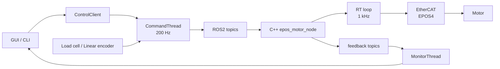

# Motor_gui_jh

EPOS4 기반 모터를 GUI/CLI에서 제어하고, C++ ROS2 노드가 1 kHz RT 루프로 EtherCAT 출력을 담당하는 실험용 제어 앱입니다.

## 한눈에 보기

| 구분 | 내용 |
| --- | --- |
| 목적 | 모터 속도/위치/토크 제어, 힘 제어, 파형/히스테리시스 실험, CSV 로깅 |
| 실행 | GUI는 `python3 run_gui.py`, CLI는 `python3 run_cli.py` |
| Python | 화면, 사용자 동작, 명령 큐, 센서 직접 읽기, 상태 표시 |
| C++ | ROS2 토픽 수신, 1 kHz RT 제어 루프, EtherCAT PDO, 안전 정지, CSV 로그 |
| 센서 | 로드셀과 리니어 엔코더는 GUI 내장 리더 또는 독립 ROS2 노드 중 하나로 사용 |
| 안전 | Python soft limit + C++ hard force limit + heartbeat timeout + fault 처리 |



## 빠른 시작

```bash
cd /home/user/K-FLEX/TS_vivration_project/Motor_gui_jh
source /opt/ros/jazzy/setup.bash
cd cpp && ./build_cpp.sh
cd .. && python3 run_gui.py
```

CLI 상태 확인:

```bash
cd /home/user/K-FLEX/TS_vivration_project/Motor_gui_jh
python3 run_cli.py config
python3 run_cli.py status --seconds 2 --hz 5
```

## 어디를 보면 되나

| 하고 싶은 일 | 먼저 볼 위치 |
| --- | --- |
| GUI 버튼/화면 수정 | `py/motor_gui_app/panels/`, `py/motor_gui_app/actions/` |
| GUI와 CLI 공통 제어 흐름 수정 | `py/motor_gui_app/core/control_client.py` |
| ROS2 명령 발행/센서값 발행 수정 | `py/motor_gui_app/core/commander.py` |
| 모터/로드셀/엔코더 최신 상태 조회 수정 | `py/motor_gui_app/core/monitor.py`, `core/feedback_state.py` |
| 설정 기본값 수정 | `py/motor_gui_app/config/defaults.json` |
| 토픽 이름 수정 | `py/motor_gui_app/core/topics.py` |
| C++ 실시간 제어/안전 로직 수정 | `cpp/src/epos_control/include/control/`, `include/safety/` |
| EtherCAT/EPOS4 저수준 처리 수정 | `cpp/src/epos_control/include/ethercat/`, `src/epos_motor_node.cpp` |

## 폴더 구조

```text
Motor_gui_jh/
├── run_gui.py                 # GUI 실행
├── run_cli.py                 # CLI 실행
├── py/motor_gui_app/
│   ├── app/                   # Qt/rclpy 앱 진입점
│   ├── cli/                   # argparse 기반 CLI
│   ├── core/                  # GUI/CLI 공용 제어, 설정, ROS2 통신, 상태
│   ├── devices/               # GUI 프로세스 안에서 직접 읽는 Phidget 장치
│   ├── nodes/                 # GUI 없이 센서만 퍼블리시하는 ROS2 노드
│   ├── panels/                # PyQt 위젯 생성/배치
│   ├── actions/               # 버튼/입력 이벤트 처리
│   └── ui/                    # 메인 윈도우, 런타임 객체, 화면 갱신
├── py/tools/                  # 로그 분석, 캘리브레이션 등 보조 도구
├── cpp/                       # ROS2 colcon 워크스페이스
│   └── src/epos_control/      # EPOS4 EtherCAT 제어 노드
└── logs/                      # CSV 로그 기본 저장 위치
```

상세 구조는 `py/motor_gui_app/README.md`와 `cpp/README.md`에 나눠 적어두었습니다.

## 현재 분리 기준

Python 쪽은 화면 생성(`panels/`), 사용자 동작(`actions/`), 공용 제어 API(`core/control_client.py`), 런타임 스레드(`core/commander.py`, `core/monitor.py`), 장치 접근(`devices/`, `nodes/`)으로 나눴습니다. GUI와 CLI는 같은 `ControlClient`와 명령 경로를 사용합니다.

공유 계산만 `core/`로 뺐습니다. 예를 들어 로드셀 캘리브레이션, IIR 필터, 리니어 엔코더 count/mm 변환, 모터 tick/mm 변환은 공용 모듈에 있고, 장치 연결과 콜백 처리는 `devices/`와 `nodes/`에 남겨두었습니다.

GUI 런타임 객체 접근 경로는 아래처럼 통일했습니다.

| 객체 | 접근 경로 |
| --- | --- |
| 백그라운드 스레드 | `window.runtime_threads.commander`, `window.runtime_threads.monitor`, `window.runtime_threads.node_runner` |
| 센서 리더 | `window.device_readers.load_cell`, `window.device_readers.linear_encoder` |
| 제어 API와 상태 조회 | `window.session.control`, `window.session.state` |
| 실행 플래그 | `window.session.flags` 또는 호환 property인 `window.motor_running` 등 |

`CommandThread`의 200 Hz 루프는 heartbeat, 센서 피드백 발행, 명령 큐 처리, 수동/스크립트 목표 계산, 소프트 리미트 적용으로 나뉘어 있습니다. 새 센서 발행은 `_publish_*_feedback()` 계열, 새 명령 경로는 `_drain_command_queues()` 쪽을 먼저 보면 됩니다.

로드셀 힘 한계는 두 단계입니다. Python은 soft-start 지점부터 RPM 명령을 서서히 줄이고, C++ RT 루프는 같은 한계를 hard stop 조건으로 다시 확인합니다. GUI 내장 센서 리더와 독립 센서 노드를 같은 토픽에 동시에 켜면 GUI 로그에 경고가 뜨지만, 실험 중에는 한쪽만 사용하는 것이 안전합니다.

## 설정 파일과 설정 로더

- `py/motor_gui_app/config/defaults.json`: 사용자가 조정하는 기본값 데이터입니다. 모터 상한, 파형 기본값, 힘 제어 PID, 로드셀/리니어 엔코더 기본값이 들어 있습니다.
- `py/motor_gui_app/core/config.py`: 위 JSON을 읽고, 환경변수 override를 적용하고, 위험한 값은 허용 범위 안으로 제한한 뒤 `DEFAULT_*` 상수로 내보내는 Python 코드입니다.

루트 `run_gui.py`와 `run_cli.py`는 실행 시 `EPOS_DEFAULTS_FILE`을 배포 폴더 안의 `defaults.json`으로 잡아 줍니다. 다른 설정 파일을 시험하려면 실행 전에 `EPOS_DEFAULTS_FILE=/path/to/defaults.json`을 지정하면 됩니다.

## 첫 설치 명령

새 PC에서 이 폴더를 처음 사용할 때는 아래 순서대로 실행합니다. ROS2 Jazzy는 Ubuntu에 이미 설치되어 있고 `/opt/ros/jazzy`가 있는 상태를 기준으로 합니다.

ROS2 설치 확인:

```bash
source /opt/ros/jazzy/setup.bash
ros2 --version
```

기본 빌드 도구와 Python GUI/분석 패키지 설치:

```bash
sudo apt update
sudo apt install -y \
  build-essential \
  cmake \
  git \
  python3-colcon-common-extensions \
  python3-pip \
  python3-venv \
  python3-tk \
  python3-numpy \
  python3-matplotlib \
  python3-sklearn \
  python3-pyqt5 \
  python3-pyqtgraph
```

Python 패키지 설치. 현재 PC처럼 시스템 Python을 그대로 쓰면 venv 없이도 됩니다. 다른 PC에서 Python 패키지를 폴더별로 맞추고 싶으면 아래처럼 venv를 사용합니다.

```bash
cd /home/user/K-FLEX/TS_vivration_project/Motor_gui_jh
python3 -m venv --system-site-packages .venv
source .venv/bin/activate
python3 -m pip install --upgrade pip
python3 -m pip install -r py/requirements.txt
```

venv를 쓰지 않고 시스템 Python에 바로 설치할 때:

```bash
cd /home/user/K-FLEX/TS_vivration_project/Motor_gui_jh
python3 -m pip install --user -r py/requirements.txt
```

Ubuntu에서 `externally-managed-environment` 오류가 나오면 venv 방식을 쓰는 편이 안전합니다.

C++/ROS2 노드 빌드:

```bash
cd /home/user/K-FLEX/TS_vivration_project/Motor_gui_jh/cpp
./build_cpp.sh
```

GUI 실행:

```bash
cd /home/user/K-FLEX/TS_vivration_project/Motor_gui_jh
source /opt/ros/jazzy/setup.bash
python3 run_gui.py
```

## C++ 빌드

ROS2 자체는 이 폴더에 넣지 않습니다. Ubuntu에 설치된 `/opt/ros/jazzy`를 사용합니다.

```bash
cd /home/user/K-FLEX/TS_vivration_project/Motor_gui_jh/cpp
./build_cpp.sh
```

직접 빌드하려면:

```bash
cd /home/user/K-FLEX/TS_vivration_project/Motor_gui_jh/cpp
source /opt/ros/jazzy/setup.bash
colcon build --packages-select soem epos_interfaces epos_control --cmake-args -DCMAKE_BUILD_TYPE=Release
```

`cpp/src` 안의 패키지:

- `soem`: EtherCAT 통신 라이브러리. `epos_control`이 의존하므로 이 폴더 안에 함께 둡니다.
- `epos_interfaces`: GUI와 C++ 노드가 공유하는 구조화 ROS2 메시지.
- `epos_control`: EPOS4 EtherCAT 실시간 제어 노드.

## GUI 실행

```bash
cd /home/user/K-FLEX/TS_vivration_project/Motor_gui_jh
python3 run_gui.py
```

`rclpy`를 찾지 못한다는 오류가 나면 먼저 `source /opt/ros/jazzy/setup.bash`를 실행한 뒤 다시 실행합니다.

## CLI 실행

GUI를 켜지 않고 C++ 모터 노드가 이미 실행 중인 상태를 확인하거나, 짧은 수동 명령을 보낼 때 사용합니다.
제어 명령은 기본적으로 `ControlClient`를 통과하므로 GUI 버튼과 같은 명령 경로를 씁니다.

인자 없이 실행하면 대화형 프롬프트가 열립니다. 이 모드에서는 GUI처럼 `CommandThread`와 `MonitorThread`를 한 번만 띄운 뒤 계속 재사용합니다. 그래서 그 안에서 `status`, `stop`, `rpm ...` 같은 명령을 이어서 입력할 수 있습니다.

```bash
cd /home/user/K-FLEX/TS_vivration_project/Motor_gui_jh
python3 run_cli.py
```

대화형 프롬프트 예:

```text
motor> status
motor> rpm 50 --seconds 1
motor> stop
motor> exit
```

도움말:

```bash
python3 run_cli.py --help
```

현재 적용된 설정 파일과 주요 기본값 확인:

```bash
python3 run_cli.py config
```

스크립트나 자동화에서는 한 줄 명령도 그대로 사용할 수 있습니다. 한 줄 명령은 필요한 ROS2 세션을 잠깐 만들고, 명령이 끝나면 정리합니다. 상태 한 번 출력:

```bash
python3 run_cli.py status
```

2초 동안 상태 출력:

```bash
python3 run_cli.py status --seconds 2 --hz 5
```

정지 명령:

```bash
python3 run_cli.py stop
```

짧은 RPM 테스트. 지정 시간이 지나면 0 rpm으로 되돌립니다.

```bash
python3 run_cli.py rpm 50 --seconds 1
```

tick 위치 명령:

```bash
python3 run_cli.py position 4000 --speed 500 --seconds 2
```

속도 사인 기반 히스테리시스 테스트. GUI와 같은 `HysteresisExperiment` 흐름을 사용합니다.

```bash
python3 run_cli.py hyst-velocity --freq 1 --amp-rpm 50 --settle-cycles 1 --record-cycles 3
```

루트 `run_gui.py`와 `run_cli.py`가 자동으로 설정하는 값:

- `EPOS_WORKSPACE_DIR=Motor_gui_jh/cpp`
- `WS_SETUP=Motor_gui_jh/cpp/install/setup.bash`
- `EPOS_LOG_DIR=Motor_gui_jh/logs`
- `EPOS_DEFAULTS_FILE=Motor_gui_jh/py/motor_gui_app/config/defaults.json`

## Python 환경

현재 PC처럼 ROS2, PyQt5, pyqtgraph, Phidget22가 시스템에 설치되어 있으면 venv 없이 시스템 Python으로 실행하는 쪽이 가장 단순합니다.

다른 PC에서 Python 패키지만 따로 맞추고 싶으면 venv를 선택적으로 만들 수 있습니다. ROS2의 `rclpy`는 pip 패키지가 아니라 ROS 설치에서 오므로, 일반 venv보다 `--system-site-packages`를 쓰는 편이 덜 헷갈립니다.

```bash
cd /home/user/K-FLEX/TS_vivration_project/Motor_gui_jh
python3 -m venv --system-site-packages .venv
source .venv/bin/activate
python3 -m pip install -r py/requirements.txt
```

GUI나 노드를 실행하기 전에 ROS2 환경이 필요하면 아래처럼 먼저 source 합니다.

```bash
source /opt/ros/jazzy/setup.bash
```

## 독립 노드 실행

로드셀 노드:

```bash
cd /home/user/K-FLEX/TS_vivration_project/Motor_gui_jh
python3 py/motor_gui_app/nodes/load_cell_node.py --ros-args \
  -p n_channels:=2 \
  -p publish_hz:=200 \
  -p debug_print_hz:=10
```

리니어 엔코더 노드:

```bash
cd /home/user/K-FLEX/TS_vivration_project/Motor_gui_jh
python3 py/motor_gui_app/nodes/linear_encoder_node.py --ros-args \
  -p channel:=0 \
  -p counts_per_mm:=314.4 \
  -p publish_hz:=100 \
  -p debug_print_hz:=10
```

## 도구 실행

로그 분석 GUI:

```bash
cd /home/user/K-FLEX/TS_vivration_project/Motor_gui_jh
python3 py/tools/log_analysis_gui.py
```

장력 루프 CLI 플롯:

```bash
cd /home/user/K-FLEX/TS_vivration_project/Motor_gui_jh
python3 py/tools/plot_tension_loop.py logs/example.csv --mode both --show
```

로드셀 캘리브레이션 GUI:

```bash
cd /home/user/K-FLEX/TS_vivration_project/Motor_gui_jh
python3 py/tools/load_cell_calibration_gui.py
```

## 주의

- ROS2 Jazzy, colcon, Python Qt/pyqtgraph, Phidget22 라이브러리는 시스템에 설치되어 있어야 합니다.
- 로드셀 캘리브레이션 GUI는 `tkinter`, `matplotlib`, `scikit-learn`, `Phidget22`를 사용합니다. Ubuntu에서 `tkinter`가 없으면 `sudo apt install python3-tk`가 필요할 수 있습니다.
- `cpp/build`, `cpp/install`, `cpp/log`는 빌드 산출물이므로 다른 PC로 옮기기 전에는 지워도 됩니다.
- `logs/`는 실험 데이터가 쌓이는 위치입니다. 코드만 배포할 때는 비워둬도 됩니다.
