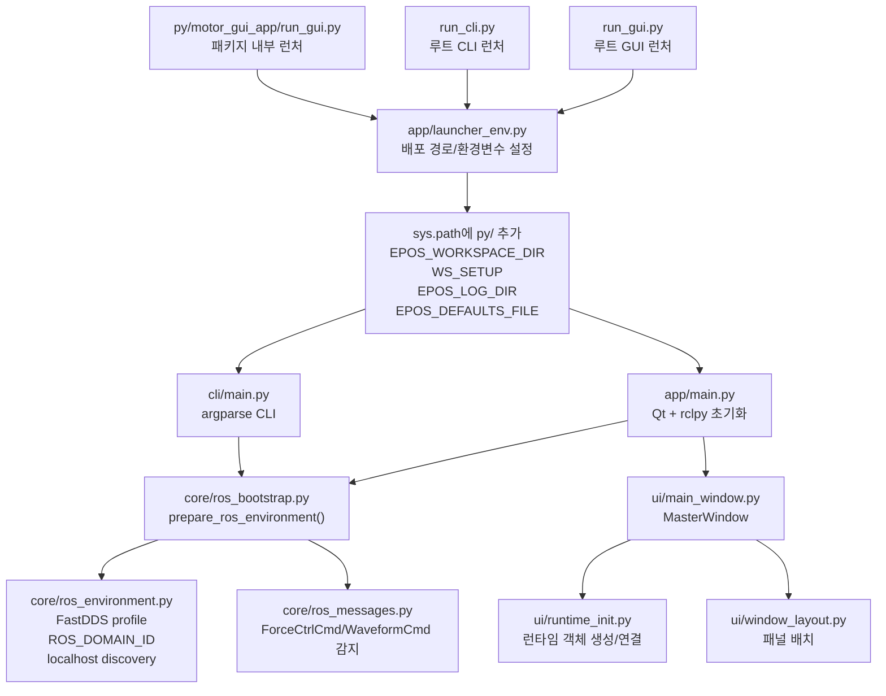
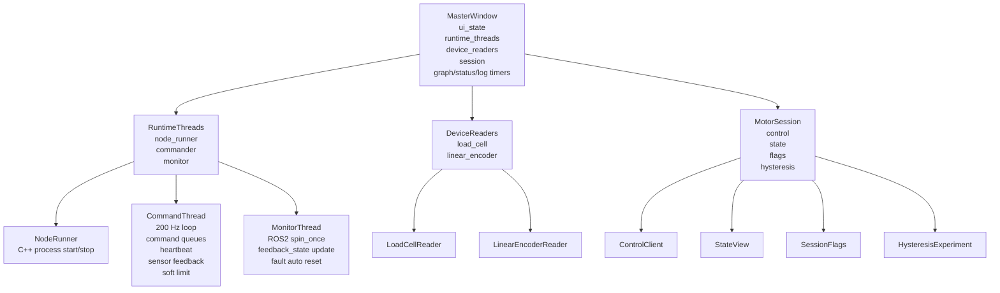
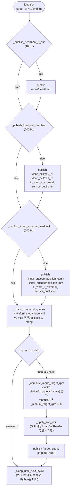
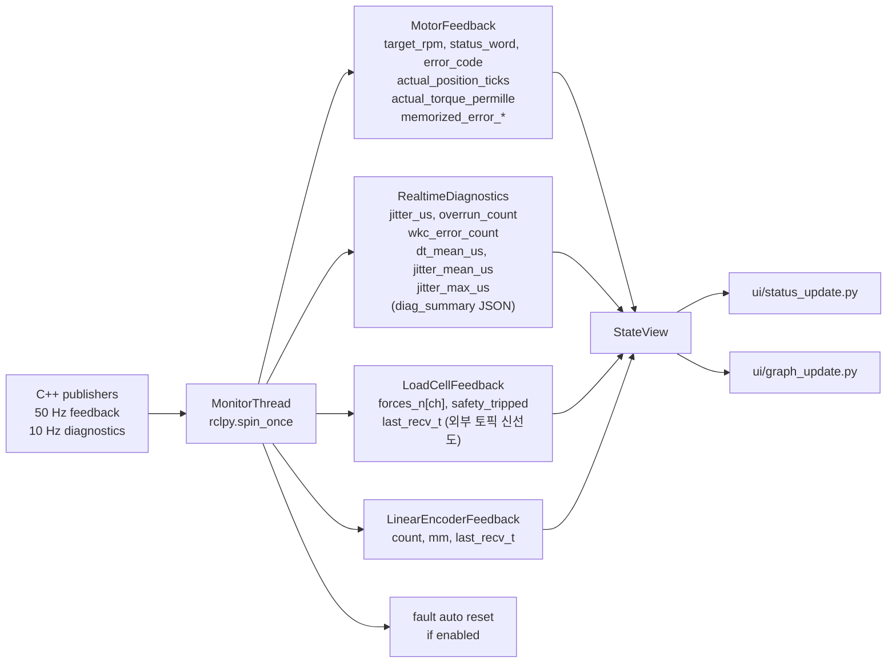
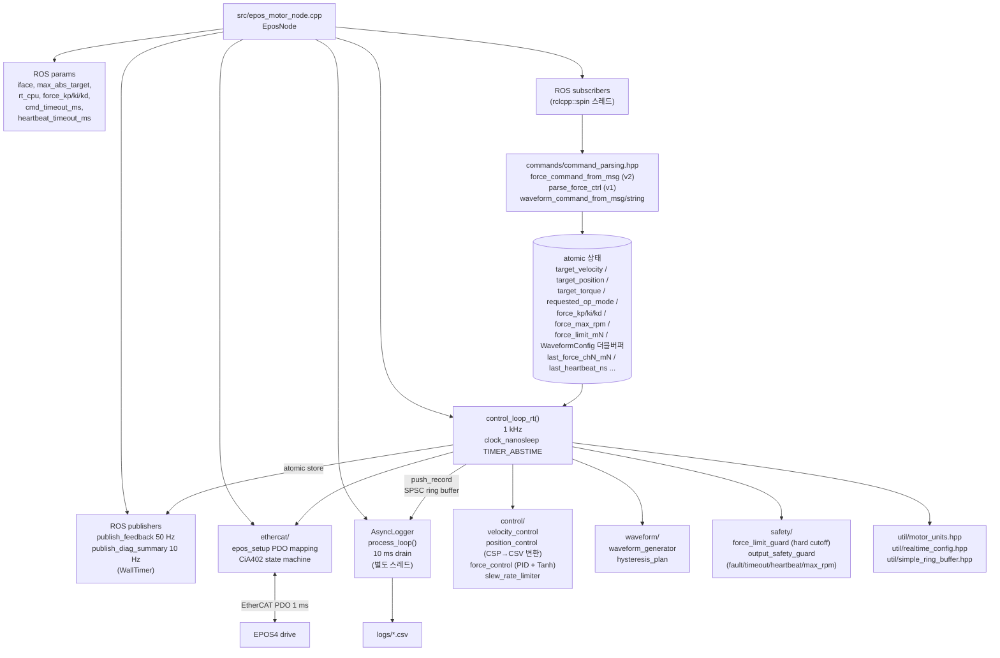
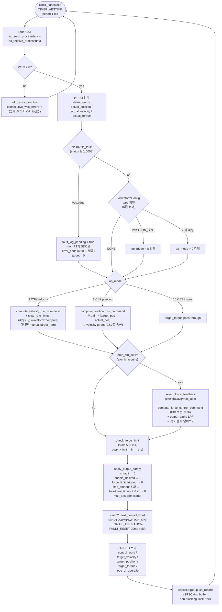
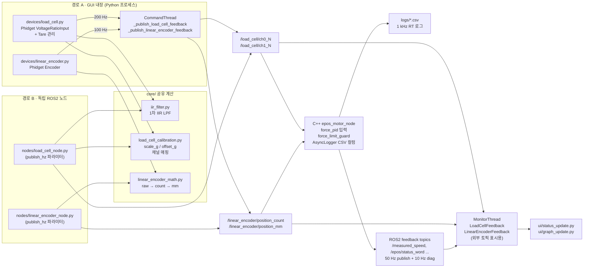

# Motor GUI 상세 아키텍처 맵

이 문서는 메인 `README.md`를 길게 만들지 않기 위해 분리한 상세 구조도입니다.
GitHub에서 열면 Mermaid 블록다이어그램이 바로 렌더링됩니다.

## 1. 실행 진입점과 환경 준비

## 2. Python GUI 코드 맵

```mermaid
flowchart LR
    subgraph UI["ui/"]
        MainWindow["main_window.py<br/>MasterWindow"]
        RuntimeInit["runtime_init.py<br/>threads/devices/session"]
        Layout["window_layout.py<br/>패널 조립"]
        State["window_state.py<br/>화면 상태"]
        Widgets["widget_groups.py<br/>위젯 묶음 dataclass"]
        GraphUpdate["graph_update.py<br/>그래프 갱신"]
        StatusUpdate["status_update.py<br/>상태 표시 갱신"]
        RuntimeComponents["runtime_components.py<br/>RuntimeThreads/DeviceReaders"]
        SessionProps["session_properties.py<br/>호환 property"]
    end

    subgraph Panels["panels/ 화면 생성"]
        TopPanel["top_status_panel.py"]
        MotionPanel["motion_control_panel.py"]
        ForcePanel["force_control_panel.py"]
        LoadPanel["load_cell_panel.py"]
        HystPanel["hysteresis_panel.py"]
        ScriptPanel["script_logging_panel.py"]
        GraphPanel["graph_panel.py"]
        LogPanel["log_viewer_panel.py"]
        StopPanel["emergency_stop_panel.py"]
        VisibilityPanel["panel_visibility_bar.py"]
    end

    subgraph Actions["actions/ 사용자 동작"]
        SystemActions["system_actions.py"]
        MotionActions["motion_actions.py"]
        ForceActions["force_control_actions.py"]
        LoadActions["load_cell_actions.py"]
        LinearActions["linear_encoder_actions.py"]
        HystActions["hysteresis_actions.py"]
        WaveActions["waveform_actions.py"]
        ScriptActions["script_actions.py"]
        LoggingActions["logging_actions.py"]
    end

    subgraph Core["core/ 공유 제어"]
        Client["control_client.py<br/>GUI/CLI 공용 API"]
        Commander["commander.py<br/>200 Hz 명령 발행"]
        Monitor["monitor.py<br/>피드백 구독"]
        NodeRunner["node_runner.py<br/>C++ 노드 실행/종료"]
        Builders["command_builders.py<br/>v2 msg 또는 v1 string"]
        Topics["topics.py"]
        Config["config.py<br/>defaults.json loader"]
        Feedback["feedback_state.py"]
        Session["session/<br/>MotorSession/StateView/Flags"]
        Experiments["experiments/<br/>HysteresisExperiment"]
        IIR["iir_filter.py<br/>1차 IIR LPF 공유"]
        Units["motor_units.py<br/>tick/mm 변환 공유"]
        LCCal["load_cell_calibration.py<br/>캘리브레이션 JSON 해석"]
        LEMath["linear_encoder_math.py<br/>count/mm 환산"]
    end

    subgraph Devices["devices/ GUI 내장 장치"]
        LoadDevice["load_cell.py"]
        LinearDevice["linear_encoder.py"]
    end

    subgraph Nodes["nodes/ 독립 센서 노드"]
        LoadNode["load_cell_node.py"]
        LinearNode["linear_encoder_node.py"]
    end

    MainWindow --> RuntimeInit
    MainWindow --> Layout
    MainWindow --> State
    Layout --> Panels
    Panels --> Actions
    Actions --> Client
    Actions --> Devices
    RuntimeInit --> RuntimeComponents
    RuntimeInit --> Commander
    RuntimeInit --> Monitor
    RuntimeInit --> NodeRunner
    RuntimeInit --> Session
    Client --> Builders
    Client --> Commander
    Client --> Experiments
    Commander --> Topics
    Monitor --> Topics
    Monitor --> Feedback
    Devices --> Commander
    Devices --> IIR
    Devices --> LCCal
    Devices --> LEMath
    Nodes --> Topics
    Nodes --> IIR
    Nodes --> LCCal
    Nodes --> LEMath
    Actions --> Units
    GraphUpdate --> Session
    StatusUpdate --> Session
```

## 3. 런타임 객체 관계

## 4. 동작별 명령 경로

| 사용자 동작 | GUI 파일 | Action | 공용 API | CommandThread/토픽 | C++ 수신 |
| --- | --- | --- | --- | --- | --- |
| 모터 노드 시작/종료 | `top_status_panel.py` | `system_actions.toggle_motor` | - | `NodeRunner.start/stop` (sudo + chrt -f 50) | `epos_motor_node` main |
| 수동 RPM | `motion_control_panel.py` | `motion_actions.send_manual_rpm` | `ControlClient.set_manual_rpm` | `/target_speed` (`Int32`, Reliable) | `target_` atomic |
| 위치 이동 | `motion_control_panel.py` | `motion_actions.send_manual_pos` | `move_to_position_ticks` | `/target_position`, `/pos_speed_limit` | `target_pos_`, `pos_speed_limit_` |
| 수동 토크 | `motion_control_panel.py` | `motion_actions.send_manual_trq` | `set_manual_torque` | `/target_torque` (‰ rated torque) | `target_trq_` |
| 모드 전환 (CSV/CSP/CST) | `motion_control_panel.py` | `motion_actions.change_op_mode` | `set_operation_mode` | `/op_mode_cmd` (8/9/10) | `requested_op_mode_` |
| 파형 시작/정지 | `motion_control_panel.py` | `waveform_actions` | `start_waveform / stop_waveform` | `/epos/waveform_cmd_v2` (v2) / `/epos/waveform_cmd` (v1) | `WaveformConfig` 더블버퍼 |
| 힘 제어 시작/정지 | `force_control_panel.py` | `force_control_actions` | `start_force_control / stop_force_control` | `/epos/force_ctrl_cmd_v2` (v2) / `/epos/force_ctrl_cmd` (v1) | `force_ctrl_active_` + 게인 atomic |
| 힘 제어 PID/Tanh 모드 | `force_control_panel.py` | `force_control_actions` | `apply_force_pid / apply_force_tanh` | 위 토픽 (ACTION_SET_PID / ACTION_SET_TANH) | `force_ctrl_mode_` atomic |
| 로드셀 tare/단위/한계 | `load_cell_panel.py` | `load_cell_actions` | `set_force_limit`, `set_force_tare_offset`, `sync_force_tare_offsets` | `/load_cell/*` 발행 + force ctrl cmd | `force_limit_mN_`, `force_tare_chN_mN_` |
| 리니어 엔코더 연결/zero | `motion_control_panel.py` | `linear_encoder_actions` | `LinearEncoderReader.zero` (로컬) | `/linear_encoder/position_count`, `/linear_encoder/position_mm` 발행 | `last_linear_count_`, `last_linear_um_` (CSV 로그 컬럼) |
| 스크립트 실행 | `script_logging_panel.py` | `script_actions` | `start_motion_script / stop_motion_script` | `CommandThread`가 200 Hz로 `target_rpm(t,state)` 평가 → `/target_speed` | `target_` atomic |
| 히스테리시스 실험 | `hysteresis_panel.py` | `hysteresis_actions` | `HysteresisExperiment.start / abort` | `/epos/waveform_cmd_v2` (ACTION_START_HYST_VELOCITY/POSITION) | `make_hyst_velocity_plan` + AsyncLogger window |
| CSV 로깅 (수동) | `script_logging_panel.py` | `logging_actions` | `start_csv_logging / stop_csv_logging` | `/epos/log_cmd` (`"start <path>"` / `"stop"`) | `AsyncLogger.start/stop_logging` |
| Heartbeat (자동) | - | - | - | `CommandThread`가 10 Hz로 `/epos/heartbeat` 발행 | `last_heartbeat_ns_` (timeout 시 정지) |
| Fault 자동 복구 | `top_status_panel.py` | (체크박스) | `MonitorThread.set_auto_fault_reset` | `/epos_motor_node/fault_reset` 서비스 호출 | `fault_reset_req_` atomic |

## 5. CommandThread 200 Hz 루프

소프트 리미트는 **GUI 내장 `LoadCellReader`가 직접 USB로 연결된 경우에만** 동작합니다.
외부 `load_cell_node.py`만 켜져 있고 GUI 내장 리더는 연결하지 않은 경우 Python soft limit은
적용되지 않고, C++ RT 루프의 `check_force_limit` 하드 컷오프만 작동합니다.

## 6. MonitorThread 피드백 경로

## 7. C++ 제어 노드 내부 맵

C++ 노드 안에는 세 종류의 실행 스레드가 있습니다.
**(a) rclcpp::spin 스레드** — ROS2 콜백 처리, non-RT.
**(b) RT 제어 스레드** — `control_loop_rt()`, 1 kHz, SCHED_FIFO + mlockall.
**(c) AsyncLogger 스레드** — 10 ms 간격 CSV flush.

## 8. C++ 1 ms RT 루프 상세

EPOS4의 CSP 모드(클럭 sync) 대신 마스터 측 P 제어로 위치를 CSV(속도) 명령으로 변환합니다.
위치 사인파(`POSITION_SINE`)는 자동으로 op_mode=8(CSP) 강제, 다른 파형은 op_mode=9(CSV) 강제.

## 9. 센서와 로그 데이터 경로

같은 ROS2 토픽(`/load_cell/ch*_N`, `/linear_encoder/position_*`)에 두 가지 입력 경로가 있습니다.
실험 중에는 한쪽만 켜야 데이터가 섞이지 않으며, 동시에 켜지면 `CommandThread`가 GUI 로그에 경고를 띄웁니다.

## 10. 새 기능을 추가할 때 보는 순서

| 추가 작업 | 수정 후보 |
| --- | --- |
| 새 버튼/입력 추가 | `panels/*_panel.py`에서 위젯 생성, `actions/*_actions.py`에서 동작 구현 |
| 새 제어 명령 추가 | `core/control_client.py`에 고수준 메서드 추가, `core/command_builders.py`에 메시지/문자열 생성 추가 |
| 새 ROS2 토픽 추가 | `core/topics.py`, `core/commander.py` 또는 `core/monitor.py`, C++ subscriber/publisher |
| 새 센서 추가 | `devices/` 직접 리더, 필요 시 `nodes/` 독립 노드, 공통 계산은 `core/` |
| 새 실험 플로우 추가 | `core/experiments/`에 상태 흐름, GUI action/CLI에서 같은 객체 재사용 |
| 새 RT 제어 로직 추가 | `cpp/src/epos_control/include/control/`에 계산 분리, `epos_motor_node.cpp` RT 루프에서 호출 |
| 새 안전 조건 추가 | `include/safety/output_safety_guard.hpp` 또는 별도 guard 헤더 |
| 새 로그 컬럼 추가 | `include/logging/async_logger.hpp`, `epos_motor_node.cpp`의 record push 지점 |
