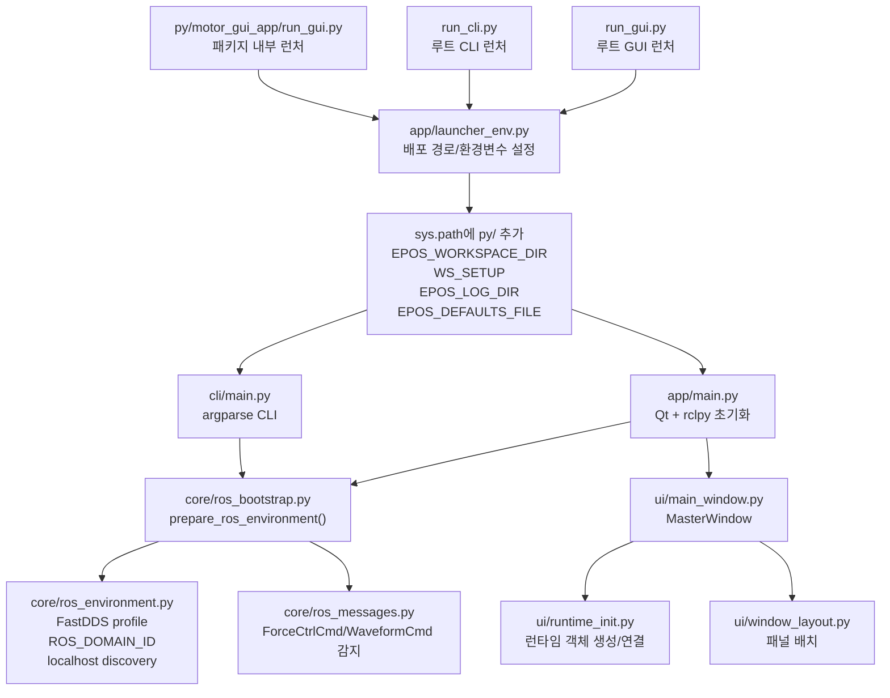
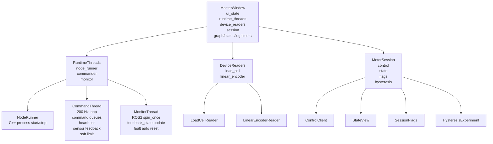
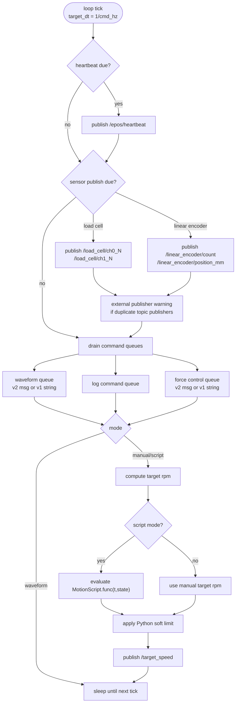
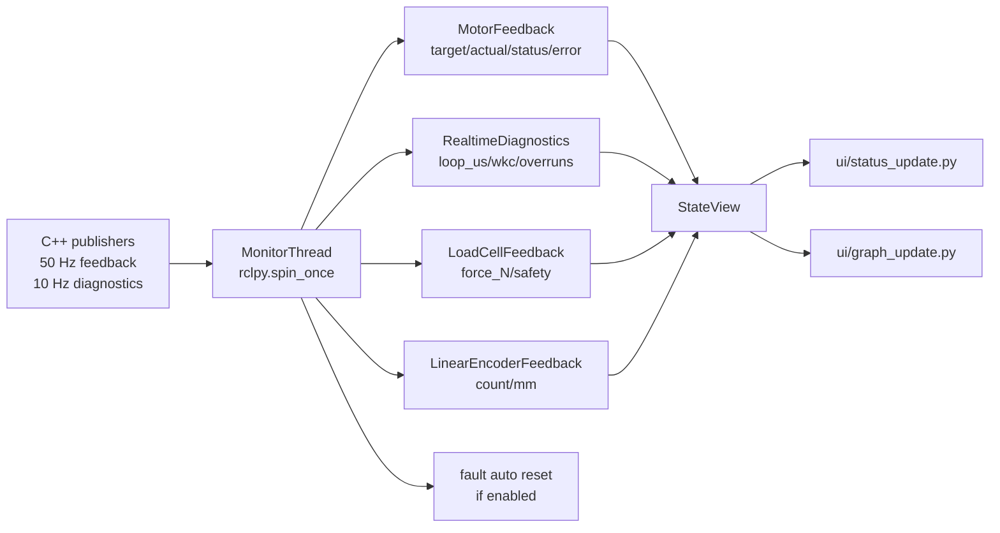
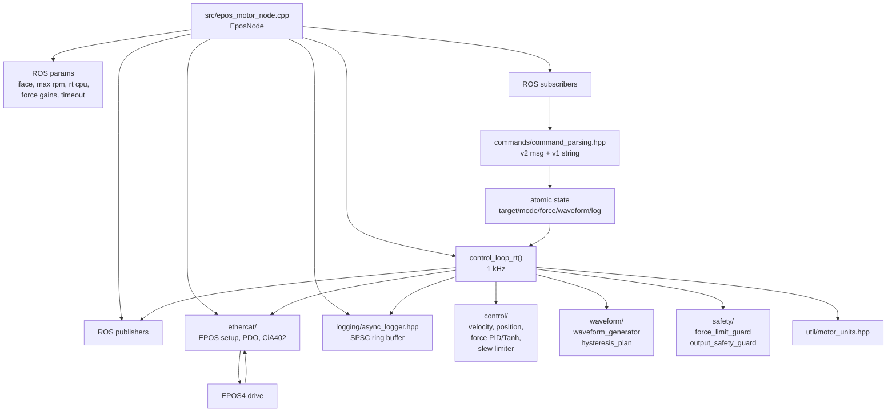
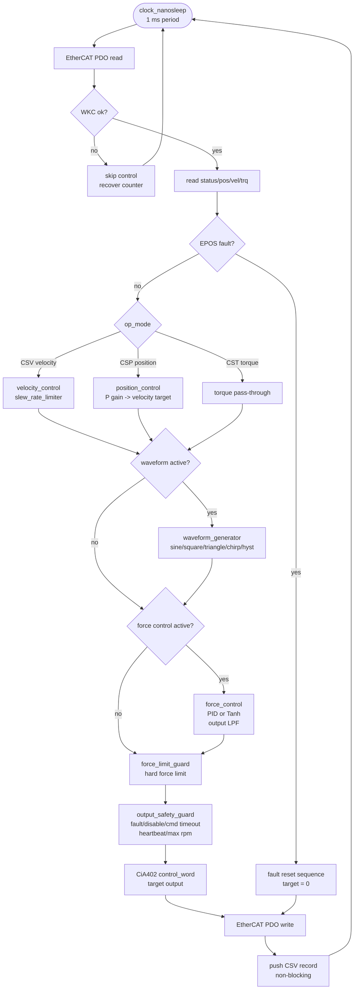
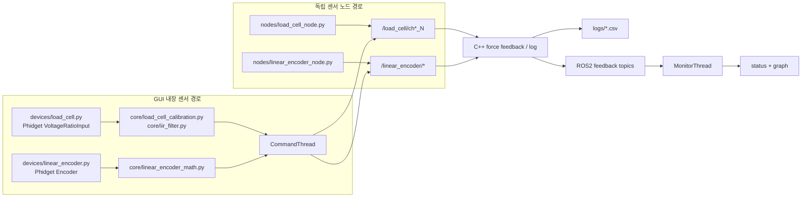

# Motor GUI 상세 아키텍처 맵

이 문서는 메인 `README.md`를 길게 만들지 않기 위해 분리한 상세 구조도입니다.
GitHub에서 열면 Mermaid 블록다이어그램이 바로 렌더링됩니다.

## 1. 실행 진입점과 환경 준비

## 2. Python GUI 코드 맵

```mermaid
flowchart LR
    subgraph UI["ui/"]
        MainWindow["main_window.py<br/>MasterWindow"]
        RuntimeInit["runtime_init.py<br/>threads/devices/session"]
        Layout["window_layout.py<br/>패널 조립"]
        State["window_state.py<br/>화면 상태"]
        Widgets["widget_groups.py<br/>위젯 묶음 dataclass"]
        GraphUpdate["graph_update.py<br/>그래프 갱신"]
        StatusUpdate["status_update.py<br/>상태 표시 갱신"]
        RuntimeComponents["runtime_components.py<br/>RuntimeThreads/DeviceReaders"]
        SessionProps["session_properties.py<br/>호환 property"]
    end

    subgraph Panels["panels/ 화면 생성"]
        TopPanel["top_status_panel.py"]
        MotionPanel["motion_control_panel.py"]
        ForcePanel["force_control_panel.py"]
        LoadPanel["load_cell_panel.py"]
        HystPanel["hysteresis_panel.py"]
        ScriptPanel["script_logging_panel.py"]
        GraphPanel["graph_panel.py"]
        LogPanel["log_viewer_panel.py"]
        StopPanel["emergency_stop_panel.py"]
        VisibilityPanel["panel_visibility_bar.py"]
    end

    subgraph Actions["actions/ 사용자 동작"]
        SystemActions["system_actions.py"]
        MotionActions["motion_actions.py"]
        ForceActions["force_control_actions.py"]
        LoadActions["load_cell_actions.py"]
        LinearActions["linear_encoder_actions.py"]
        HystActions["hysteresis_actions.py"]
        WaveActions["waveform_actions.py"]
        ScriptActions["script_actions.py"]
        LoggingActions["logging_actions.py"]
    end

    subgraph Core["core/ 공유 제어"]
        Client["control_client.py<br/>GUI/CLI 공용 API"]
        Commander["commander.py<br/>200 Hz 명령 발행"]
        Monitor["monitor.py<br/>피드백 구독"]
        NodeRunner["node_runner.py<br/>C++ 노드 실행/종료"]
        Builders["command_builders.py<br/>v2 msg 또는 v1 string"]
        Topics["topics.py"]
        Config["config.py<br/>defaults.json loader"]
        Feedback["feedback_state.py"]
        Session["session/<br/>MotorSession/StateView/Flags"]
        Experiments["experiments/<br/>HysteresisExperiment"]
    end

    subgraph Devices["devices/ GUI 내장 장치"]
        LoadDevice["load_cell.py"]
        LinearDevice["linear_encoder.py"]
    end

    subgraph Nodes["nodes/ 독립 센서 노드"]
        LoadNode["load_cell_node.py"]
        LinearNode["linear_encoder_node.py"]
    end

    MainWindow --> RuntimeInit
    MainWindow --> Layout
    MainWindow --> State
    Layout --> Panels
    Panels --> Actions
    Actions --> Client
    Actions --> Devices
    RuntimeInit --> RuntimeComponents
    RuntimeInit --> Commander
    RuntimeInit --> Monitor
    RuntimeInit --> NodeRunner
    RuntimeInit --> Session
    Client --> Builders
    Client --> Commander
    Client --> Experiments
    Commander --> Topics
    Monitor --> Topics
    Monitor --> Feedback
    Devices --> Commander
    Nodes --> Topics
    GraphUpdate --> Session
    StatusUpdate --> Session
```

## 3. 런타임 객체 관계

## 4. 동작별 명령 경로

| 사용자 동작 | GUI 파일 | Action | 공용 API | CommandThread/토픽 | C++ 수신 |
| --- | --- | --- | --- | --- | --- |
| 모터 노드 시작/종료 | `top_status_panel.py` | `system_actions.py` | - | `NodeRunner`가 `epos_motor_node` subprocess 실행 | `epos_motor_node.cpp` main |
| 수동 RPM | `motion_control_panel.py` | `motion_actions.py` | `ControlClient.set_manual_rpm()` | `/target_speed` | target atomic |
| 위치 이동 | `motion_control_panel.py` | `motion_actions.py` | `move_to_position_ticks()` | `/target_position`, `/pos_speed_limit` | position control |
| 수동 토크 | `motion_control_panel.py` | `motion_actions.py` | `set_manual_torque()` | `/target_torque` | torque pass-through |
| 파형 시작/정지 | `motion_control_panel.py` | `waveform_actions.py` | `start_waveform()` | `/epos/waveform_cmd_v2` 또는 v1 | waveform double buffer |
| 힘 제어 시작/정지 | `force_control_panel.py` | `force_control_actions.py` | `start_force_control()` | `/epos/force_ctrl_cmd_v2` 또는 v1 | force PID/Tanh |
| 로드셀 tare/단위/한계 | `load_cell_panel.py` | `load_cell_actions.py` | `set_force_limit()`, tare sync | `/load_cell/*`, force limit cmd | force feedback/limit |
| 리니어 엔코더 연결/zero | `motion_control_panel.py` | `linear_encoder_actions.py` | - | `/linear_encoder/*` | CSV/log/후속 위치 분석 |
| 스크립트 실행 | `script_logging_panel.py` | `script_actions.py` | `start_motion_script()` | `CommandThread`가 200 Hz 평가 | `/target_speed` |
| 히스테리시스 실험 | `hysteresis_panel.py` | `hysteresis_actions.py` | `HysteresisExperiment` | waveform + log command | RT waveform + CSV |
| CSV 로깅 | `script_logging_panel.py` | `logging_actions.py` | `start_logging()` | `/epos/log_cmd` | `AsyncLogger` |

## 5. CommandThread 200 Hz 루프

## 6. MonitorThread 피드백 경로

## 7. C++ 제어 노드 내부 맵

## 8. C++ 1 ms RT 루프 상세

## 9. 센서와 로그 데이터 경로

## 10. 새 기능을 추가할 때 보는 순서

| 추가 작업 | 수정 후보 |
| --- | --- |
| 새 버튼/입력 추가 | `panels/*_panel.py`에서 위젯 생성, `actions/*_actions.py`에서 동작 구현 |
| 새 제어 명령 추가 | `core/control_client.py`에 고수준 메서드 추가, `core/command_builders.py`에 메시지/문자열 생성 추가 |
| 새 ROS2 토픽 추가 | `core/topics.py`, `core/commander.py` 또는 `core/monitor.py`, C++ subscriber/publisher |
| 새 센서 추가 | `devices/` 직접 리더, 필요 시 `nodes/` 독립 노드, 공통 계산은 `core/` |
| 새 실험 플로우 추가 | `core/experiments/`에 상태 흐름, GUI action/CLI에서 같은 객체 재사용 |
| 새 RT 제어 로직 추가 | `cpp/src/epos_control/include/control/`에 계산 분리, `epos_motor_node.cpp` RT 루프에서 호출 |
| 새 안전 조건 추가 | `include/safety/output_safety_guard.hpp` 또는 별도 guard 헤더 |
| 새 로그 컬럼 추가 | `include/logging/async_logger.hpp`, `epos_motor_node.cpp`의 record push 지점 |
